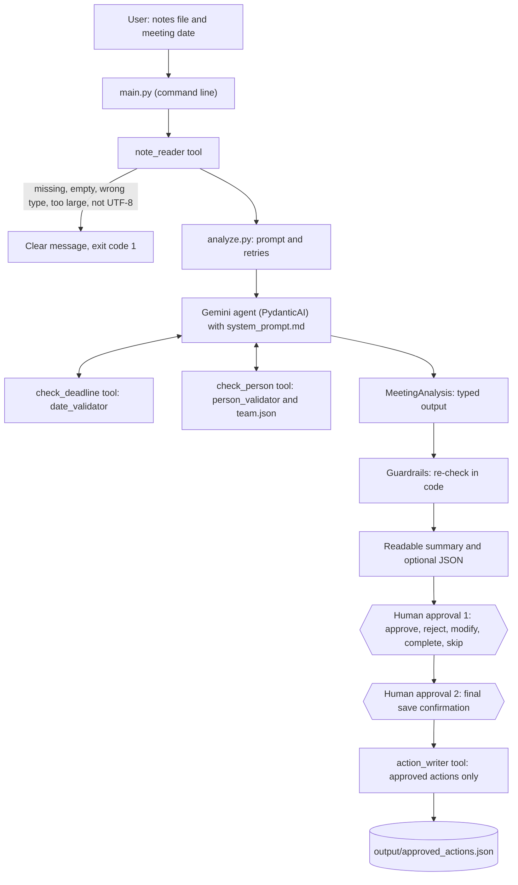

# Architecture

## Overview

One agent, two tools, three safety layers and two human approval points. The agent proposes, code verifies,
and a human decides.

## Diagram

## Components

| Part | Where | Role |
|---|---|---|
| User interaction | `src/main.py`, `src/review.py` | Command line, review loop, final save question |
| Agent | `src/agent.py`, `config/system_prompt.md` | Classifies notes using the rules in the prompt |
| Model | `src/llm.py`, `.env` | Gemini; model name and key come from `.env` |
| Tool: note reader | `src/tools/note_reader.py` | Safe file reading with clear errors |
| Tool: date validator | `src/tools/date_validator.py` | Exact dates resolve; vague wording never does |
| Tool: person validator | `src/tools/person_validator.py`, `config/team.json` | Found, ambiguous, role or unknown |
| Tool: summary generator | `src/tools/summary.py` | Readable follow-up summary |
| Tool: action writer | `src/tools/action_writer.py` | Writes approved items of the saveable types, atomically |
| Guardrails | `src/guardrails.py` | Deterministic checks after the model answers |
| Data model | `src/models.py` | Eight item types; owner and deadline optional; status pending, approved or rejected |
| Retry logic | `src/analyze.py` | Retries busy-service errors (429, 5xx): 4 attempts, 5, 10 and 20 seconds |
| Stored output | `output/approved_actions.json` | Approved actions with `source_file` and `saved_at` (git-ignored) |

## Human approval points

1. **Item review.** Every item is approved, rejected, modified, completed or skipped. Items with an open
   question need an extra confirmation to approve. End of input approves nothing.
2. **Final save confirmation.** "Save N approved item(s)?" Only approved items of the saveable types are written.

## Safety layers

1. **Instructions:** the system prompt forbids invented owners and dates and treats the notes as data.
2. **Tools:** dates and people come from code, not from the model's guess.
3. **Guardrails:** every item is reset to pending, quoted evidence must appear in the notes, owners must be in
   the notes and pass the person validator, deadlines are re-validated. Every correction is logged and shown.

## Error handling

| Failure | Behaviour |
|---|---|
| Missing, empty, oversized, wrong-type or non-UTF-8 file | Clear message, exit code 1 |
| Invalid meeting date | Rejected before any model call |
| Model returns an invalid structure | The model retries (up to 2) |
| Busy service (429, 5xx) | Automatic retries, then a clear message |
| Wrong model name or key | Fails immediately with the provider's message |
| Team file unavailable | The person tool reports an error; no owner is assigned |
| Output file unreadable | Save stops with a clear message; nothing is overwritten |

## Configuration

Secrets and the model name are in `.env` (never committed). Paths, limits and saveable types are in
`config/settings.yaml`. The rules for the model are in `config/system_prompt.md`. The fictional team is in
`config/team.json`.